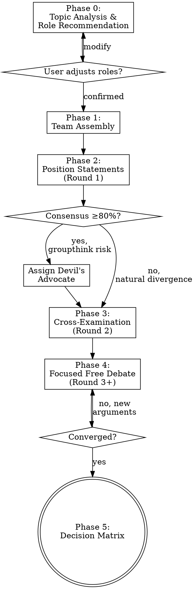

# Expert Panel Debate

Assemble an Agent Team of independent expert roles to conduct structured multi-round deliberation on a given topic, converging on actionable proposals presented as a decision matrix.

## When to Use

- User asks to analyze a problem from multiple expert perspectives
- Technical architecture or solution selection decisions
- Strategy choices with competing valid approaches
- Any scenario where "it depends on who you ask" — and you want to ask all of them

## When NOT to Use

- Simple factual questions with clear answers
- Tasks that need implementation, not analysis
- Problems with obvious single solutions

## Process Flow



## Phase 0: Topic Analysis & Role Recommendation

1. Analyze the user's topic
2. Recommend 3-5 expert roles, each with:
   - Role name (used as agent `name`)
   - Domain expertise
   - Expected perspective bias (e.g., "prioritizes scalability over simplicity")
3. Present to user for adjustment (add/remove/modify)
4. Proceed only after user confirms the roster

**Role examples by domain:**

| Domain | Typical Roles |
|--------|---------------|
| Tech architecture | Systems Architect, DevOps Engineer, Security Engineer, Product Manager, Cost Analyst |
| Product strategy | Product Manager, UX Researcher, Business Analyst, Engineering Lead, Customer Success |
| Data infrastructure | Data Engineer, ML Engineer, Platform Architect, Compliance Officer, Cost Analyst |

## Phase 1: Team Assembly

```
TeamCreate → team_name: "expert-panel-{topic-slug}"

For each expert:
  Agent tool →
    team_name: "expert-panel-{topic-slug}"
    name: "{role-slug}" (e.g., "systems-architect")
    subagent_type: "general-purpose"
    model: "sonnet"
    prompt: [Expert prompt with role definition, topic, rules]
```

**Model strategy (cost optimization):**
- **Experts: Sonnet** — sufficient for domain-specific argumentation; ~80% cost reduction vs Opus
- **Moderator (you): Opus** — handles convergence judgment, cross-expert synthesis, and decision matrix
- Override with `model: "opus"` for experts on highly nuanced topics where reasoning depth is critical

**Expert prompt must include:**
- Role identity and expertise area
- The topic and all background context from user
- Debate rules:
  - Maintain your professional perspective
  - Support arguments with evidence and concrete examples
  - Challenge other experts constructively with specific counterpoints
  - Update your position when presented with compelling evidence
  - Use SendMessage to communicate with other experts and the moderator

## Phase 2: Position Statements (Round 1 — Structured)

1. Moderator sends topic to all experts
2. Each expert independently produces:
   - Recommended approach/solution
   - Core rationale (evidence-based)
   - Anticipated risks and limitations
3. Moderator collects all positions
4. **Present summary to user:** each expert's stance + initial divergence map

## Phase 2.5: Consensus Check & Devil's Advocate

After collecting Phase 2 positions, evaluate consensus level:

- **High consensus (≥80% same direction):** This is a groupthink risk signal. Automatically assign at least one expert as **Devil's Advocate** — tasked with building the strongest possible case AGAINST the consensus position. Choose the expert whose domain is most relevant to the counter-argument (e.g., PM for organizational concerns, DevOps for operational risks).
- **Natural divergence (<80%):** Proceed directly to Phase 3 cross-examination on the existing disagreement axes.

**Devil's Advocate rules:**
- Must argue the opposing position as if they genuinely believe it
- Must cite concrete evidence, precedents, or scenarios — not strawman arguments
- The goal is to stress-test the consensus, not to flip the outcome
- Forward the Devil's Advocate case to ALL other experts for rebuttal

## Phase 3: Cross-Examination (Round 2 — Structured)

1. Moderator identifies key disagreement axes from Round 1 (including Devil's Advocate challenges if triggered)
2. Assigns cross-examination pairs via SendMessage
   - e.g., "Architect, challenge DevOps on deployment complexity claims"
3. Experts debate directly via SendMessage to each other
4. **Present summary to user:** arguments, counterarguments, positions shifted

## Phase 4: Focused Free Debate (Round 3+ — Convergence-Driven)

1. Moderator distills 2-3 unresolved core disputes
2. Sends dispute summary to all experts, invites free debate
3. Experts debate freely via SendMessage
4. After each round, moderator evaluates convergence:

**Convergence criteria (all three must hold):**
- **Position stability**: No expert changed their recommended solution
- **Argument novelty**: No substantively new arguments introduced
- **Disagreement scope**: Disputes narrowed to weight/priority, not fundamental approach

**Safety cap:** Maximum 5 total rounds. If not converged by round 5, proceed to Phase 5 with remaining disagreements noted.

## Phase 5: Decision Matrix Output

Moderator synthesizes all rounds into:

```markdown
## Decision Matrix: <Topic>

### Solutions Under Consideration
- **Solution A**: [brief description]
- **Solution B**: [brief description]

### Evaluation

| Dimension | Solution A | Solution B | Solution C |
|-----------|-----------|-----------|-----------|
| Dim 1     | ★★★★☆ rationale | ★★★☆☆ rationale | ... |
| Dim 2     | ... | ... | ... |

### Key Trade-offs
- [trade-off 1: what you gain vs what you lose]
- [trade-off 2]

### Expert Final Positions
- **Role A**: Favors X because...
- **Role B**: Favors Y because...

### Recommendation
[Synthesized recommendation with conditions and caveats]
```

After output, shutdown all expert agents via SendMessage `shutdown_request`.

## Moderator Rules

- **Never take sides** during Phases 2-4 — only in final recommendation
- **Summarize each round** with key points and disagreements for user visibility
- **Guide convergence** by narrowing debate focus each round
- **Prevent circular arguments** — if same points repeat, flag and move forward
- **Respect the safety cap** — 5 rounds maximum

## Common Mistakes

| Mistake | Fix |
|---------|-----|
| Experts converge too quickly (groupthink) | Phase 2.5 auto-triggers Devil's Advocate when consensus ≥80%. Ensure expert prompts emphasize maintaining independent perspective |
| Debate goes in circles | Moderator must narrow focus each round, not repeat same questions |
| Too many experts (>6) | More noise than signal; 3-5 is the sweet spot |
| Skipping cross-examination | Round 2 is critical — it forces experts to engage with each other's actual arguments |
| Moderator takes sides early | Undermines trust; save opinions for final recommendation only |
